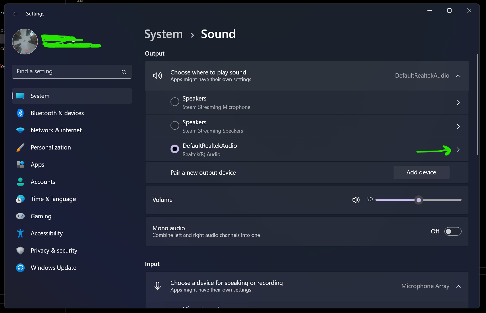
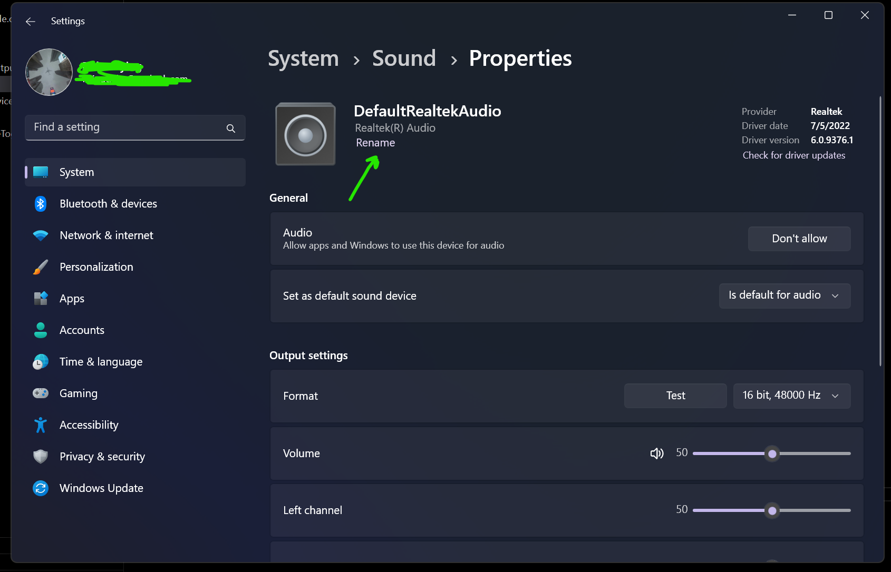

# MyBatchScripts

My batch scripts to run some everyday tasks

- [MyBatchScripts](#mybatchscripts)
  - [BatchFiles](#batchfiles)
    - [`startAVD`](#startavd)
    - [`restartAudioService`](#restartaudioservice)
    - [`defaultSoundOutput`](#defaultsoundoutput)
  - [Executables (compiled from C)](#executables-compiled-from-c)
    - [`taskbarAutohideToggle`](#taskbarautohidetoggle)

## BatchFiles

### [`startAVD`](startAVD.bat)

To start an Android emulator installed using Android Studio/Android Virtual Device manager

**_Usage_**

```bash
./startAVD [NameOfTheEmulator]
```

### [`restartAudioService`](restartAudioService.bat)

To restart windows audio service when you have some weird errors with the audio output

**_Usage_**

```bash
./restartAudioService
```

### [`defaultSoundOutput`](defaultSoundOutput.bat)

To change the current audio output

**_Usage_**

Change the variable audioSource in the [bat file](defaultSoundOutput.bat) with the name of the audio source you want to set.




```bash
./defaultSoundOutput [AudioOutputSourceName]
```

## Executables (compiled from C)

### [`taskbarAutohideToggle`](./CSourceFiles/taskbarAutohide.c)

To toggle windows taskbar auto-hide

**_Usage_**

```bash
./taskbarAutohideToggle
```
